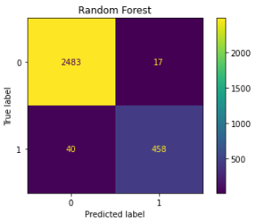
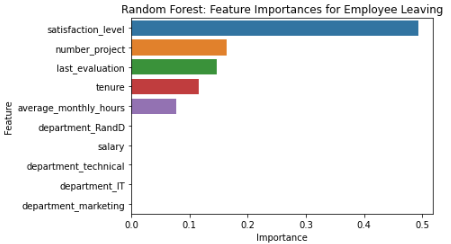

#               Capstone Project: Employee Turnover Prediction

  

Welcome to my **Capstone Project**! In this project, I developed a **predictive model** to identify **employee turnover** at **Salifort Motors**, a fictional company. Using **data analytics** and **machine learning** techniques, I built a robust model that can predict whether employees are likely to stay or leave the company. This is a crucial business challenge, and my solution aims to help organizations reduce turnover costs and improve employee retention. 🚀

Click the following files to see detailed results of this project:

- [PACE Strategy Document](Course%207%20PACE%20strategy%20document.pdf)
- [Executive Summary](Salifort_Motors_executive_summary.pdf)
- [Project Lab](Activity_%20Course%207%20Salifort%20Motors%20project%20lab.ipynb)

---

## :page_facing_up: **Overview**

This project’s goal was to create a **predictive model** using machine learning algorithms such as **Logistic Regression**, **Decision Trees**, and **Random Forests** to predict **employee turnover** at **Salifort Motors**. After evaluating multiple models, the **Random Forest model** with **hyperparameter tuning** yielded the best results. 🏆

### **Key Performance Metrics**:
| **Model Name** | **Precision** | **Recall** | **F1 Score** | **Accuracy** | **ROC AUC** |
| :------------: | :-----------: | :--------: | :----------: | :----------: | :---------: |
| Random Forest (cross-validated) | 96.4% | 92.0% | 94.1% | 98.0% | 95.6% |

The most influential variables for predicting employee turnover were:
- **Satisfaction Level** 🧑‍💻
- **Number of Projects** 📈
- **Last Evaluation** 📊
- **Tenure** 🕒
- **Average Monthly Hours** ⏳

---

## :page_facing_up: **Business Understanding**

The leadership team at **Salifort Motors** was concerned about the increasing **employee turnover**, which led to significant costs in recruitment, training, and talent retention. If the company could predict which employees are likely to leave, they could take preventative actions to improve retention and reduce costs. 💡

The goal of this project was to predict whether an employee would leave the company and identify the factors contributing to their decision, thus providing actionable insights that could help reduce turnover rates. 💼

---

## :page_facing_up: **Data Understanding**

For this project, I used the [HR_capstone_dataset.csv](HR_capstone_dataset.csv) dataset, which is available on [Kaggle](https://www.kaggle.com/datasets/mfaisalqureshi/hr-analytics-and-job-prediction?select=HR_comma_sep.csv). It contains detailed employee data for approximately **15,000 employees** and includes **10 features** per employee, such as job satisfaction, tenure, number of projects, work accidents, and more. 📊

### Dataset Features:
- **Satisfaction Level** 🧑‍💻
- **Tenure** ⏳
- **Number of Projects** 📈
- **Average Monthly Hours** ⏰
- **Last Evaluation** 📅
- **Work Accident** 🚑
- **Promotion in Last 5 Years** 🌟
- **Department** 🏢
- **Salary** 💰
- **Left** (Target Variable) 🚪

The dataset provides a great foundation for exploring the factors that influence **employee turnover**.

---

## :page_facing_up: **Modeling and Evaluation**

I built and evaluated three machine learning models to predict employee turnover:

1. **Logistic Regression** 🔄: A simple baseline model.
2. **Decision Tree Classifier** 🌳: A decision-making model that splits employees based on their characteristics.
3. **Random Forest Classifier** 🌲: An ensemble method that aggregates multiple decision trees for better accuracy.

### **Champion Model: Random Forest**

The **Random Forest model** performed the best and achieved the highest **accuracy** and **precision**, making it the most reliable for this task. Below are the performance metrics for the **Random Forest model**:

#### **Confusion Matrix:**
The confusion matrix visualizes the model's performance, with **0** representing employees who stay and **1** representing employees who leave.

  

#### **Feature Importance:**
The following chart shows the **top 10 features** that the **Random Forest model** considered most important for predicting **employee turnover**. The key drivers were **satisfaction_level**, **number_project**, **last_evaluation**, **tenure**, and **average_monthly_hours**.

  

---

## :page_facing_up: **Conclusion**

Through this project, I demonstrated how **machine learning** can be used to solve real-world business problems like **employee turnover**. By predicting which employees are at risk of leaving, companies can take **proactive measures** to retain talent and reduce associated costs. 💡

The **Random Forest model** proved to be highly effective, with an **accuracy rate of 98%**. Moving forward, this model can be integrated into an organization’s **HR management system** to predict turnover and inform retention strategies. 🌟

---

## :page_facing_up: **Next Steps**

- **Real-time Deployment**: Integrate the **Random Forest model** into HR software to predict employee turnover in real-time. 💻
- **Retention Strategies**: Use insights from the model to implement targeted interventions for employees at high risk of leaving, such as career development opportunities or salary adjustments. 💼
- **Model Optimization**: Experiment with additional algorithms or fine-tune existing ones to improve performance further. 🔧

---

### **Contact Information:**

Feel free to reach out if you have any questions or would like to collaborate on similar projects:

- **Email**: masteravinashrai@gmail.com 📧
- **LinkedIn**: [Avinash Analytics](https://www.linkedin.com/in/avinashanalytics) 💼
- **Twitter**: [@AvinashAnalytiX](https://twitter.com/AvinashAnalytiX) 🐦
- **GitHub**: [AvinashAnalytics](https://github.com/AvinashAnalytics) 🧑‍💻

